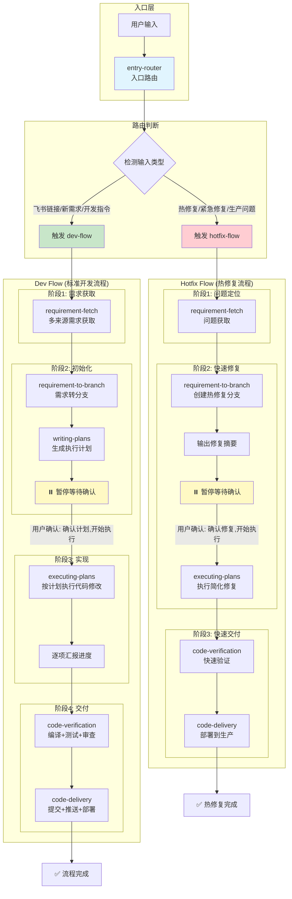
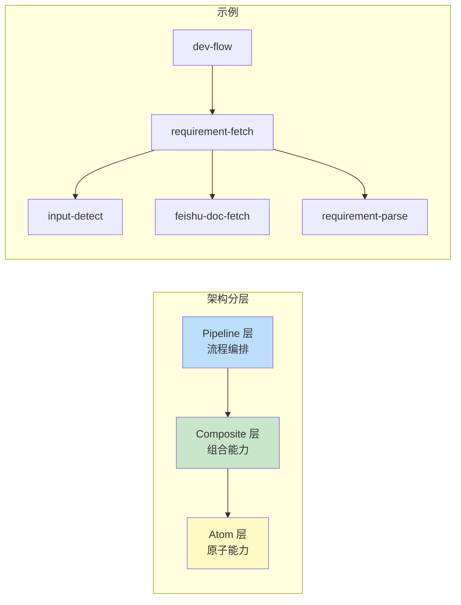

# AI DevCopilot - AI 驱动的智能开发工作流

<div align="center">

[](LICENSE)
[](CHANGELOG.md)
[](https://github.com/weieast1314/ai-devcopilot/stargazers)
[](https://github.com/weieast1314/ai-devcopilot/network/members)
[](https://github.com/weieast1314/ai-devcopilot/issues)
[](https://github.com/weieast1314/ai-devcopilot/pulls)

**基于 AI 辅助编程的标准化软件开发工作流，通过 Pipeline 架构实现细粒度 Skill 分类和灵活编排。**

[快速开始](#-快速开始) • [功能特性](#-功能特性) • [架构设计](#-架构设计) • [使用说明](#-详细使用说明) • [贡献指南](CONTRIBUTING.md) • [更新日志](CHANGELOG.md)

**🌐 中文** | **[English](README_EN.md)**

</div>

---

## 目录

- [功能特性](#-功能特性)
- [架构设计](#-架构设计)
- [工作流程图](#-工作流程图)
- [快速开始](#-快速开始)
  - [第一步：安装](#第一步安装)
  - [第二步：配置](#第二步配置)
  - [第三步：验证](#第三步验证)
- [详细使用说明](#-详细使用说明)
  - [推荐使用节奏](#推荐使用节奏)
  - [如何发起一个新需求](#如何发起一个新需求)
  - [如何进入计划模式](#如何进入计划模式)
  - [如何按计划执行](#如何按计划执行)
  - [如何做验证与交付](#如何做验证与交付)
  - [如何处理热修复](#如何处理热修复)
  - [如何在中断后继续](#如何在中断后继续)
- [配置指南](#-配置指南)
- [命令速查](#-命令速查)
- [维护者校验命令](#-维护者校验命令)
- [常见问题](#-常见问题-faq)
- [项目结构](#-项目结构)
- [贡献](#-贡献)
- [许可证](#-许可证)
- [致谢](#-致谢)

---

## 🚀 功能特性

- **🔄 全流程自动化**：从需求获取到部署验证的一站式解决方案
- **🧠 智能输入识别**：自动识别飞书链接或文字描述，智能路由到对应处理流程
- **📦 Pipeline 架构**：细粒度 Skill 分类，支持独立升级和灵活编排
- **📄 飞书文档集成**：直接从飞书文档链接开始开发任务
- **📝 文字描述支持**：直接输入需求描述即可开始开发
- **🧠 智能计划模式**：AI 自动生成详细的实施方案
- **🔧 多编辑器支持**：支持 Claude、CodeBuddy、OpenCode 等主流 AI 编辑器
- **🔒 安全配置**：双层配置架构，敏感信息与项目配置分离
- **👥 团队协作**：统一的分支命名和提交信息规范
- **🚀 一键部署**：集成 Jenkins 自动构建和部署

---

## 🏗 架构设计

AI DevCopilot 采用 **Pipeline 架构**，实现细粒度的 Skill 分类和灵活编排：

```
┌─────────────────────────────────────────────────────────────┐
│                      Pipeline (流程)                         │
│  一个易触发的名字，定义了完整的端到端工作流                      │
│  触发词: /dev, /hotfix                                       │
└─────────────────────────────────────────────────────────────┘
                              │
                              ▼
┌─────────────────────────────────────────────────────────────┐
│                     Composites (组合)                        │
│  封装常用流程，组合多个原子 Skill                              │
│  示例: requirement-fetch, code-delivery                      │
└─────────────────────────────────────────────────────────────┘
                              │
                              ▼
┌─────────────────────────────────────────────────────────────┐
│                      Atoms (原子)                            │
│  最小粒度的可复用能力单元，支持独立升级替换                       │
│  示例: input-detect, feishu-doc-fetch, git-branch-create    │
└─────────────────────────────────────────────────────────────┘
```

### 智能路由机制

```
用户输入 → entry-router (入口路由)
              ├── 飞书链接 / 新需求 / 开发指令 → dev-flow → requirement-fetch
              └── 热修复 / 紧急修复 / 生产问题 → hotfix-flow → requirement-fetch
```

### 与 superpowers 的结构级协同

为避免流程冲突，项目采用“三层优先级”协同策略：

1. **会话级（方法层）**：先调用 `using-superpowers` 做可用能力预检。  
2. **项目级（编排层）**：本项目任务必须先经过 `entry-router` 路由到 `dev-flow` / `hotfix-flow`。  
3. **阶段级（执行层）**：计划、执行、验证、收尾阶段强制使用 `superpowers` 过程型 Skills；不可用时直接阻断流程。

阶段映射（强制）：

| 阶段 | 强制 superpowers |
|------|-------------------|
| 计划 | `brainstorming` / `writing-plans` |
| 实现 | `executing-plans` / `systematic-debugging` |
| 验证 | `verification-before-completion` / `requesting-code-review` |
| 交付 | `finishing-a-development-branch` |

---

## 🔄 工作流程图

### 完整流程总览



### 架构分层示意



### 核心约束要点

| 约束项 | 说明 |
|--------|------|
| **入口路由优先** | 用户输入必须先经过 `entry-router`，禁止直接调用原子层 skill |
| **先计划后执行** | 必须先生成计划，待用户确认后才能修改代码 |
| **只按计划执行** | 实现阶段仅执行计划中的任务，不得擅自扩大范围 |
| **偏差先更新** | 发现遗漏或方案偏差，必须先更新计划再继续 |
| **逐项汇报** | 每完成一个任务，必须同步汇报状态、修改文件、验证结果 |

---

## 🛠 快速开始

> 如果你是第一次使用，建议按“安装 → 配置 → 验证”顺序走一遍。日常使用时更推荐直接输入自然语言，不必强记所有内部 Skill 名称。

### 第一步：安装

#### 方式 A：快捷安装（推荐）

```bash
curl -fsSL https://raw.githubusercontent.com/weieast1314/ai-devcopilot/main/quick-install.sh | bash
```

快捷脚本会先下载仓库到 `~/ai-devcopilot`，然后打印下一步安装命令。下载完成后执行：

```bash
cd ~/ai-devcopilot && ./install.sh
```

#### 方式 B：手动安装（macOS / Linux）

```bash
# 克隆或下载 AI DevCopilot
git clone https://github.com/weieast1314/ai-devcopilot.git /tmp/ai-devcopilot

# 运行安装脚本（将 codebuddy 替换为 claude / opencode 即可切换编辑器）
cd /tmp/ai-devcopilot
./install.sh -e codebuddy -y
```

#### 方式 C：Windows 安装（PowerShell）

```powershell
# 克隆或下载 AI DevCopilot
git clone https://github.com/weieast1314/ai-devcopilot.git $env:TEMP/ai-devcopilot
Set-Location $env:TEMP/ai-devcopilot

# 运行 PowerShell 安装脚本（将 codebuddy 替换为 claude / opencode 即可切换编辑器）
powershell -ExecutionPolicy Bypass -File .\install.ps1 -TargetProject . -Editor codebuddy -Yes
```

#### 常用安装参数

| 场景 | Shell 安装器 | PowerShell 安装器 |
|------|--------------|-------------------|
| 指定编辑器 | `-e codebuddy` | `-Editor codebuddy` |
| 跳过交互 | `-y` | `-Yes` |
| 仅预览安装计划 | `--dry-run` | `-DryRun` |
| 仅校验安装目标 | `--validate-only` | `-ValidateOnly` |
| 安装全部编辑器 | `-e all` | `-Editor all` |

脚本会自动完成以下操作：
1. 安装 Skills 到编辑器目录（如 `${EDITOR_HOME}/skills/ai-devcopilot/`）
2. 按编辑器扫描规则安装附加入口（例如 Claude 会自动创建 `${EDITOR_HOME}/skills/` 下的一级入口；Windows 下优先使用目录链接/目录联接）
3. 创建统一配置 `~/.ai-devcopilot/env.sh`（敏感信息，所有编辑器共享）
4. 创建项目配置 `.ai-devcopilot/env.sh`（项目 Job 名称，可提交 Git）
5. 创建项目数据目录 `.ai-devcopilot/memory/`

### 第二步：配置

#### 全局配置 (`~/.ai-devcopilot/env.sh`)

用于存放认证信息，**在用户主目录，不会被 Git 提交**。

```bash
# Jenkins 认证
export JENKINS_URL="http://jenkins.your-company.com"
export JENKINS_USERNAME="your_name"
export JENKINS_API_TOKEN="your_token"

# Nacos 配置（按需）
export NACOS_SERVER_ADDR="your-nacos-server:8848"
export NACOS_NAMESPACE="dev"
export NACOS_GROUP="DEFAULT_GROUP"

# 飞书认证 (如需使用飞书 MCP)
export LARK_APP_ID="cli_xxx"
export LARK_APP_SECRET="xxx"
```

#### 项目配置 (`.ai-devcopilot/env.sh`)

用于存放项目属性，可提交到 Git。

```bash
# Jenkins Job 名称
export JENKINS_JOB_DEV="project-name-dev"
export JENKINS_JOB_TEST="project-name-test"
```

### 第三步：验证

安装完成后，重启一次 AI 编辑器，然后在编辑器中任选一种方式验证：

```text
开始开发
```

```text
/dev
```

```text
热修复
```

如果看到 AI DevCopilot 开始进入标准开发流程或热修复流程，说明安装成功。

> 说明：旧文档中你可能会看到 `/dev-flow`，当前统一推荐使用 `/dev` 或自然语言触发词。

---

## 📖 详细使用说明

AI DevCopilot 的推荐用法不是“背命令”，而是“按阶段与 AI 协作”。你只需要描述当前要做什么，AI 会先路由到合适流程，再按约束推进。

### 推荐使用节奏

为了让 AI 编辑器严格按流程推进，默认遵循以下协作规则：

1. 先生成计划，再开始改代码。
2. 计划生成后默认暂停，等待你回复“确认计划，开始执行”。
3. 执行阶段只按当前计划推进，不擅自扩大范围。
4. 如果发现方案偏差、依赖变化或遗漏任务，先更新计划，再继续执行。
5. 每完成一个任务，都要汇报完成情况、修改文件、验证结果和下一步。

> 📋 更完整的协作规则请查看 [AI 流程约束规则.md](AI%20流程约束规则.md)

### 如何发起一个新需求

你可以用下面三种方式开始：

#### 方式 A：直接说“开始开发”

```text
开始开发
```

适合已经在当前项目上下文中的场景。系统会路由到 `dev-flow`。

#### 方式 B：粘贴飞书文档链接

```text
帮我实现这个需求：https://feishu.cn/wiki/xxx
```

适合已有正式需求文档的场景。系统会自动识别链接、读取需求、提取 Issue 信息，并进入标准开发流程。

#### 方式 C：直接输入文字需求

```text
#23181 需要新增用户登录功能
```

适合小型需求、补充说明或没有飞书文档时使用。系统会提取需求关键字并创建规范分支。

### 如何进入计划模式

如果 AI 还没有给出计划，可以明确要求：

```text
进入计划模式
```

或：

```text
生成计划
```

一份合格的计划通常会包含：
- 修改文件清单
- 数据库 / 配置 / 接口影响
- 执行顺序
- 验证方式
- 执行边界
- 本次不做项
- 待确认事项

计划生成后，AI 应暂停，不直接改代码。你确认后再回复：

```text
确认计划，开始执行
```

### 如何按计划执行

进入实现阶段后，推荐使用下面两类说法：

```text
确认计划，开始执行
```

```text
执行计划
```

执行过程中，你应该期待 AI 按下面节奏输出：
1. 当前完成的是哪一项
2. 修改了哪些文件
3. 做了什么改动
4. 验证结果是什么
5. 下一步准备做什么

如果 AI 发现偏差，正确行为应该是先说明偏差原因和影响范围，再更新计划，而不是直接扩大修改范围。

### 如何做验证与交付

代码改完后，建议分成两个动作：

#### 先做验证

```text
验证代码
```

或：

```text
代码验证
```

适合先看编译、测试、代码审查结果，再决定是否交付。

#### 再做交付

```text
代码交付
```

或：

```text
/code-delivery
```

交付阶段通常会做这些事：
1. 提交代码
2. 推送远程分支
3. 按你的选择执行 Jenkins、PR 或跳过部署
4. 输出交付摘要

> 说明：旧文档中你可能会看到“完成分支”或 `/finish-branch`。当前统一推荐使用“代码交付”或 `/code-delivery`。

### 如何处理热修复

遇到线上问题时，直接说：

```text
热修复
```

或：

```text
线上问题需要紧急修复
```

系统会进入 `hotfix-flow`。与标准开发流的差异是：
- 先输出修复摘要，而不是完整开发计划
- 默认只修当前故障，不顺带优化
- 需要你回复 `确认修复，开始执行` 后才开始改代码
- 验证和交付更强调快速闭环

### 如何在中断后继续

如果中途中断、换会话或编辑器重启，建议直接把当前状态告诉 AI：

```text
继续刚才的任务：当前分支 feat/23181-login，计划已确认，已经完成接口层，接下来继续执行 Service 和测试验证
```

如果你不确定当前停在哪一步，至少补充下面三类信息：
- 当前分支
- 当前计划是否已确认
- 已完成 / 未完成的任务

这样 AI 更容易恢复到正确阶段，而不是从头重新开始。

---

## ⚙️ 配置指南

AI DevCopilot 采用双层配置架构，确保敏感信息安全隔离：

### 1. 全局配置 (`~/.ai-devcopilot/env.sh`)

用于存放认证信息，**在用户主目录，不会被 Git 提交**。

```bash
# Jenkins 认证
export JENKINS_URL="http://jenkins.your-company.com"
export JENKINS_USERNAME="your_name"
export JENKINS_API_TOKEN="your_token"

# 飞书认证 (如需使用飞书 MCP)
export LARK_APP_ID="cli_xxx"
export LARK_APP_SECRET="xxx"
```

### 2. 项目配置 (`.ai-devcopilot/env.sh`)

用于存放项目属性，可提交到 Git。

```bash
# Jenkins Job 名称
export JENKINS_JOB_DEV="project-name-dev"
export JENKINS_JOB_TEST="project-name-test"
```

---

## 🧭 命令速查

> 推荐优先使用自然语言；如果你习惯显式命令，也可以使用右侧的直接触发词。

| 场景 | 推荐输入 | 直接触发词 / 兼容输入 | 对应流程 |
| :--- | :--- | :--- | :--- |
| 标准开发 | `开始开发` | `/dev` | `dev-flow` |
| 热修复 | `热修复`、`线上问题需要紧急修复` | `/hotfix` | `hotfix-flow` |
| 飞书文档需求 | `帮我实现这个需求：https://feishu.cn/wiki/xxx` | 粘贴飞书链接 | `requirement-fetch` → `dev-flow` |
| 文字需求 | `#23181 需要新增用户登录功能` | 自然语言需求描述 | `requirement-fetch` → `dev-flow` |
| 生成计划 | `进入计划模式` | `生成计划`、`写计划` | `writing-plans` |
| 开始执行 | `确认计划，开始执行` | `执行计划` | `executing-plans` |
| 代码验证 | `验证代码` | `代码验证`、`/code-verification` | `verification` / `code-verification` |
| 代码交付 | `代码交付` | `/code-delivery` | `code-delivery` |
| 代码审查 | `代码审查` | `Review` | `code-review` |

## 🧪 维护者校验命令

如果你在维护仓库本身，而不是日常使用技能，建议执行以下命令验证安装链路与产物一致性：

```bash
bash scripts/validate-dist.sh
bash scripts/check-registry.sh
bash scripts/check-install-targets.sh
bash scripts/smoke-dev-flow.sh
```

```powershell
powershell -ExecutionPolicy Bypass -File .\install.ps1 -TargetProject . -Editor all -ValidateOnly -Yes
powershell -ExecutionPolicy Bypass -File .\install.ps1 -TargetProject . -Editor all -DryRun -Yes
```

---

## ❓ 常见问题 (FAQ)

**Q: 飞书链接和文字描述如何区分？**  
A: 系统会自动检测输入类型。包含 `feishu.cn` 的链接会被识别为飞书文档，否则作为文字描述处理。

**Q: 为什么 AI 没按计划直接开始改代码？**  
A: 这是预期行为。AI 应先输出计划，并等待你回复 `确认计划，开始执行` 后再进入实现阶段。

**Q: 为什么 AI 找不到我的 Jenkins Job？**  
A: 请检查 `.ai-devcopilot/env.sh` 中的 `JENKINS_JOB_DEV` 是否与 Jenkins 上的名称完全一致。

**Q: 某个编辑器中 Skills 加载不出来怎么办？**  
A: 先检查对应编辑器的安装目录 `${EDITOR_HOME}/skills/ai-devcopilot/` 是否存在，然后重启编辑器。若使用 Claude，还需确认 `${EDITOR_HOME}/skills/` 下的一级入口已创建；如缺失可重新执行安装脚本。

**Q: 切换编辑器需要重新配置吗？**  
A: 一般不需要。重新运行安装脚本选择新编辑器即可；全局配置 `~/.ai-devcopilot/env.sh` 会继续复用。

---

## 📁 项目结构

```
ai-devcopilot/
├── core/
│   └── agent/
│       └── AI DevCopilot.source.md # 核心 Agent 单一事实源
├── dist/
│   ├── claude/                     # Claude 运行时产物
│   ├── codebuddy/                  # CodeBuddy 运行时产物
│   └── opencode/                   # OpenCode 运行时产物
├── skills/ai-devcopilot/           # Skills 源目录（Pipeline 架构）
│   ├── atoms/                      # 原子 Skill 层
│   │   ├── analysis/               # 分析类：输入检测、需求提取、需求解析
│   │   ├── devops/                 # 运维类：Jenkins、Nacos、SQL迁移
│   │   ├── feishu/                 # 飞书类：文档获取
│   │   ├── git/                    # Git类：分支创建、分支验证
│   │   ├── memory/                 # 记忆类：更新记忆
│   │   ├── planning/               # 计划类：生成计划、执行计划
│   │   ├── review/                 # 审查类：代码审查
│   │   └── verification/           # 验证类：编译测试验证
│   ├── composites/                 # 组合 Skill 层
│   ├── pipelines/                  # Pipeline 层
│   └── registry/
│       └── skills-registry.yml
├── templates/
│   ├── agent/                      # 编辑器 Agent 模板
│   ├── plan-template.md
│   ├── pr-template.md
│   └── branch-completion-report.md
├── scripts/
│   ├── build-dist.sh               # 生成多编辑器运行时产物
│   └── validate-dist.sh            # 校验 dist 与默认 Agent 产物
├── examples/                       # 使用示例
├── AI DevCopilot.md                # 默认 Agent 运行时产物（由构建脚本生成）
├── install.sh                      # 安装脚本
└── README.md                       # 项目说明
```

---

## 维护者提示

- `core/agent/AI DevCopilot.source.md` 与 `skills/ai-devcopilot/` 是主要维护源，请优先修改这里。
- `dist/` 与根目录 `AI DevCopilot.md` 属于构建产物，安装时自动生成，无需手动构建。
- 提交前建议至少执行：`bash scripts/validate-dist.sh`、`bash scripts/check-registry.sh`、`bash scripts/check-install-targets.sh`、`bash scripts/smoke-dev-flow.sh`。

---

## 🤝 贡献

我们欢迎任何形式的贡献！请阅读 [贡献指南](CONTRIBUTING.md) 了解如何参与项目开发。

### 如何贡献

1. **Fork** 本项目
2. 创建您的特性分支 (`git checkout -b feat/amazing-feature`)
3. 提交您的更改 (`git commit -m 'feat: add amazing feature'`)
4. 推送到分支 (`git push origin feat/amazing-feature`)
5. 打开一个 **Pull Request**

---

## 📄 许可证

本项目采用 MIT 许可证 - 查看 [LICENSE](LICENSE) 文件了解详情。

---

## 🙏 致谢

感谢所有为 AI DevCopilot 项目做出贡献的人！

---

<div align="center">

**[⬆ 回到顶部](#ai-devcopilot---ai-驱动的智能开发工作流)**

</div>

---

**版本**: 1.4.0  
**最后更新**: 2026-04-13  
**维护者**: weieast1314
