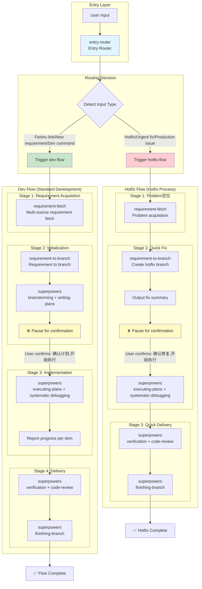

# AI DevCopilot - AI-Powered Intelligent Development Workflow

<div align="center">

[](LICENSE)
[](CHANGELOG.md)
[](https://github.com/weieast1314/ai-devcopilot/stargazers)
[](https://github.com/weieast1314/ai-devcopilot/network/members)
[](https://github.com/weieast1314/ai-devcopilot/issues)
[](https://github.com/weieast1314/ai-devcopilot/pulls)

**A standardized software development workflow based on AI-assisted programming, achieving full-process automation from requirements acquisition to code implementation and deployment verification through a highly integrated Skills system.**

[Quick Start](#-quick-start) • [Features](#-features) • [Usage Guide](#-detailed-usage-guide) • [Contributing](CONTRIBUTING.md) • [Changelog](CHANGELOG.md)

**🌐 [中文](README.md)** | **English**

</div>

---

## Table of Contents

- [Features](#-features)
- [Quick Start](#-quick-start)
  - [Step 1: Install](#step-1-install)
  - [Step 2: Configure](#step-2-configure)
  - [Step 3: Verify](#step-3-verify)
- [Detailed Usage Guide](#-detailed-usage-guide)
  - [Recommended Working Rhythm](#recommended-working-rhythm)
  - [How to Start a New Requirement](#how-to-start-a-new-requirement)
  - [How to Enter Planning Mode](#how-to-enter-planning-mode)
  - [How to Execute by Plan](#how-to-execute-by-plan)
  - [How to Verify and Deliver](#how-to-verify-and-deliver)
  - [How to Handle Hotfixes](#how-to-handle-hotfixes)
  - [How to Resume After Interruption](#how-to-resume-after-interruption)
- [Configuration Guide](#-configuration-guide)
- [Command Quick Reference](#-command-quick-reference)
- [Maintainer Validation Commands](#-maintainer-validation-commands)
- [FAQ](#-faq)
- [Project Structure](#-project-structure)
- [Contributing](#-contributing)
- [License](#-license)
- [Acknowledgments](#-acknowledgments)

---

## 🚀 Features

- **🔄 Full Process Automation**: One-stop solution from requirements acquisition to deployment verification
- **🧠 Intelligent Input Detection**: Automatically identifies Feishu links or text descriptions and routes to the appropriate flow
- **📦 Pipeline Architecture**: Fine-grained Skill classification with independent upgrades and flexible orchestration
- **📄 Feishu Document Integration**: Start development tasks directly from Feishu document links
- **📝 Plain Text Requirement Support**: Enter requirement descriptions directly to start development
- **🧠 Intelligent Planning Mode**: AI automatically generates detailed implementation plans
- **🔧 Multi-Editor Support**: Supports mainstream AI editors like Claude, CodeBuddy, OpenCode
- **🔒 Secure Configuration**: Dual-layer configuration architecture separating sensitive info from project config
- **👥 Team Collaboration**: Unified branch naming and commit message conventions
- **🚀 One-Click Deployment**: Integrated Jenkins automatic build and deployment

---

## 🏗 Architecture Design

AI DevCopilot uses a **Pipeline Architecture** to achieve fine-grained Skill classification and flexible orchestration:

```
┌─────────────────────────────────────────────────────────┐
│                   Pipeline  Flow Layer                    │
│  Easy to trigger, defines complete E2E workflow           │
│  Examples: dev-flow, hotfix-flow                         │
└─────────────────────────────────────────────────────────┘
                        │
        ┌───────────────┼───────────────┐
        ▼               ▼               ▼
┌─────────────────┐ ┌──────────┐ ┌─────────────────────┐
│  Composites     │ │  Atoms   │ │  Superpowers        │
│  Combination    │ │  Atomic  │ │  Process (Mandatory)│
├─────────────────┤ ├──────────┤ ├─────────────────────┤
│ Encapsulates    │ │ Smallest │ │ brainstorming      │
│ common flows    │ │ reusable │ │ writing-plans      │
│ combines atoms  │ │ unit     │ │ executing-plans     │
│                 │ │          │ │ verification        │
│ requirement-   │ │ input-   │ │ code-review        │
│   fetch        │ │   detect │ │ ...                 │
│ requirement-    │ │ feishu-  │ │                     │
│   to-branch    │ │   doc-   │ │                     │
│                │ │   fetch  │ │                     │
└─────────────────┘ └──────────┘ └─────────────────────┘
```

### Intelligent Routing Mechanism

```
User Input → entry-router (Entry Router)
              ├── Feishu link / New requirement / Dev command → dev-flow → requirement-fetch
              └── Hotfix / Urgent fix / Production issue → hotfix-flow → requirement-fetch
```

### Structural Coordination with Superpowers

To avoid flow conflicts, the project adopts a "three-layer priority" coordination strategy:

1. **Session Level (Method Layer)**: Call `using-superpowers` first for available capability pre-check.
2. **Project Level (Orchestration Layer)**: All project tasks must first be routed through `entry-router` to `dev-flow` / `hotfix-flow`.
3. **Stage Level (Execution Layer)**: Plan, Execute, Verify, Delivery stages force the use of `superpowers` process Skills; flow is blocked if unavailable.

Stage Mapping (Mandatory):

| Stage | Mandatory Superpowers |
|-------|----------------------|
| Plan | `brainstorming` / `writing-plans` |
| Execute | `executing-plans` / `systematic-debugging` |
| Verify | `verification-before-completion` / `requesting-code-review` |
| Delivery | `finishing-a-development-branch` |

---

## 🔄 Workflow Diagram

### Complete Flow Overview



### Architecture Layer Overview

```mermaid
flowchart LR
    subgraph Architecture Layers
        direction TB
        L1[Pipeline Layer<br/>Flow Orchestration] --> L2[Composite Layer<br/>Base Combination] --> L3[Atom Layer<br/>Atomic Capability] --> L4[Superpowers Layer<br/>Process Capability(Mandatory)]
    end

    subgraph Examples
        P[dev-flow] --> C1[requirement-fetch]
        C1 --> A1[input-detect]
        C1 --> A2[feishu-doc-fetch]
        C1 --> A3[requirement-parse]
        P --> SP[superpowers<br/>Stage capability]
    end

    style L1 fill:#bbdefb
    style L2 fill:#c8e6c9
    style L3 fill:#fff9c4
    style L4 fill:#ffcdd2
```

### Core Constraint Summary

| Constraint | Description |
|------------|-------------|
| **Entry Router First** | User input must first go through `entry-router`; direct Atom skill calls are prohibited |
| **Plan Before Execute** | Plan must be generated first; code changes only after user confirmation |
| **Execute Only Plan Items** | Implementation stage only executes planned tasks; scope expansion prohibited |
| **Update Plan on Deviation** | On discovering gaps or deviations, update the plan before continuing |
| **Report Per Item** | After completing each task, report status, modified files, and verification results |

---

## 🛠 Quick Start

> If this is your first time, follow Install → Configure → Verify once. For daily use, natural language is recommended over memorizing internal Skill names.

### Step 1: Install

#### Option A: Quick Install (Recommended)

```bash
curl -fsSL https://raw.githubusercontent.com/weieast1314/ai-devcopilot/main/quick-install.sh | bash
```

The quick script downloads the repository into `~/ai-devcopilot` and prints the next install command. After it finishes, run:

```bash
cd ~/ai-devcopilot && ./install.sh
```

#### Option B: Manual Install (macOS / Linux)

```bash
# Clone or download AI DevCopilot
git clone https://github.com/weieast1314/ai-devcopilot.git /tmp/ai-devcopilot

# Run the installer (replace codebuddy with claude / opencode if needed)
cd /tmp/ai-devcopilot
./install.sh -e codebuddy -y
```

#### Option C: Windows Install (PowerShell)

```powershell
# Clone or download AI DevCopilot
git clone https://github.com/weieast1314/ai-devcopilot.git $env:TEMP/ai-devcopilot
Set-Location $env:TEMP/ai-devcopilot

# Run the PowerShell installer
powershell -ExecutionPolicy Bypass -File .\install.ps1 -TargetProject . -Editor codebuddy -Yes
```

#### Common installer options

| Scenario | Shell installer | PowerShell installer |
|----------|-----------------|----------------------|
| Specify editor | `-e codebuddy` | `-Editor codebuddy` |
| Skip interaction | `-y` | `-Yes` |
| Preview install plan only | `--dry-run` | `-DryRun` |
| Validate targets only | `--validate-only` | `-ValidateOnly` |
| Install all editors | `-e all` | `-Editor all` |

The installers automatically:
1. Install Skills into the editor directory (for example, `${EDITOR_HOME}/skills/ai-devcopilot/`)
2. Create editor-specific scan entries when required (for example, Claude gets top-level entries under `${EDITOR_HOME}/skills/`; on Windows the installer prefers directory links/junctions)
3. Create unified configuration `~/.ai-devcopilot/env.sh` for sensitive shared settings
4. Create project configuration `.ai-devcopilot/env.sh` for project-specific job names
5. Create project data directory `.ai-devcopilot/memory/`

### Step 2: Configure

#### Global Configuration (`~/.ai-devcopilot/env.sh`)

Used to store authentication information and should not be committed to Git.

```bash
# Jenkins Authentication
export JENKINS_URL="http://jenkins.your-company.com"
export JENKINS_USERNAME="your_name"
export JENKINS_API_TOKEN="your_token"

# Nacos Configuration (optional)
export NACOS_SERVER_ADDR="your-nacos-server:8848"
export NACOS_NAMESPACE="dev"
export NACOS_GROUP="DEFAULT_GROUP"

# Feishu Authentication (if using Feishu MCP)
export LARK_APP_ID="cli_xxx"
export LARK_APP_SECRET="xxx"
```

#### Project Configuration (`.ai-devcopilot/env.sh`)

Used to store project-specific settings and can be committed to Git.

```bash
# Jenkins Job Names
export JENKINS_JOB_DEV="project-name-dev"
export JENKINS_JOB_TEST="project-name-test"
```

### Step 3: Verify

Restart your AI editor once, then verify with any of the following:

```text
Start development
```

```text
/dev
```

```text
Hotfix
```

If AI DevCopilot starts the standard development flow or the hotfix flow, the installation is working.

> Note: older docs may mention `/dev-flow`. The current recommended trigger is `/dev` or natural-language input.

---

## 📖 Detailed Usage Guide

AI DevCopilot is best used as a staged collaboration workflow. You describe what you want to do, and the system routes that request to the right flow, then proceeds with planning, execution, verification, and delivery.

### Recommended Working Rhythm

By default, AI DevCopilot follows these collaboration rules:

1. Plan first, edit later.
2. After the plan is generated, AI pauses until you reply `确认计划，开始执行`.
3. During implementation, AI should only execute approved plan items.
4. If deviations are found, AI should update the plan before continuing.
5. After each completed item, AI should report changes, touched files, verification result, and next step.

> For the complete collaboration constraints, see [AI 流程约束规则.md](AI%20流程约束规则.md).

### How to Start a New Requirement

You can begin in three common ways.

#### Option A: Say “Start development”

```text
Start development
```

This is suitable when the current repository context is already clear. The system routes the request to `dev-flow`.

#### Option B: Paste a Feishu document link

```text
Help me implement this requirement: https://feishu.cn/wiki/xxx
```

This is best when you already have a formal requirement document. AI will identify the link, parse the requirement, and continue with the standard development flow.

#### Option C: Describe the requirement in plain text

```text
#23181 Add a user login feature
```

This is useful for smaller requirements, follow-up tasks, or when no Feishu document exists. AI will extract requirement information and create a standard branch.

### How to Enter Planning Mode

If AI has not produced a plan yet, you can explicitly say:

```text
Enter planning mode
```

or:

```text
Generate plan
```

A good plan usually includes:
- files to be modified
- database / configuration / API impact
- execution order
- verification approach
- scope boundary
- non-goals
- confirmation items

After the plan is generated, AI should pause instead of editing code immediately. You then reply:

```text
确认计划，开始执行
```

### How to Execute by Plan

Recommended ways to move into implementation are:

```text
确认计划，开始执行
```

```text
Execute plan
```

During implementation, AI should report in this rhythm:
1. what item has just been completed
2. which files were modified
3. what changed
4. verification result
5. what comes next

If AI discovers a deviation, the correct behavior is to explain the issue and update the plan first, instead of silently expanding the scope.

### How to Verify and Deliver

After the code is finished, use two separate actions.

#### Verify first

```text
Verify code
```

or:

```text
Code verification
```

Use this when you want to review build, test, and code review results before delivery.

#### Deliver next

```text
代码交付
```

or:

```text
/code-delivery
```

The delivery phase usually covers:
1. committing code
2. pushing the branch
3. triggering Jenkins, creating a PR, or skipping deployment based on your choice
4. producing a delivery summary

> Note: older docs may mention `Finish branch` or `/finish-branch`. The current recommended wording is `代码交付` or `/code-delivery`.

### How to Handle Hotfixes

For production issues, say:

```text
Hotfix
```

or:

```text
We need an urgent fix for a production issue
```

This routes to `hotfix-flow`. Compared with the standard development flow:
- AI outputs a fix summary before code changes
- the fix should stay focused on the current fault only
- execution starts only after `确认修复，开始执行`
- verification and delivery are optimized for fast closure

### How to Resume After Interruption

If the conversation is interrupted, the editor restarts, or you switch sessions, resume by restating the current status, for example:

```text
Continue the previous task: current branch is feat/23181-login, the plan is already confirmed, API work is done, continue with service logic and verification
```

If you are not sure where the workflow stopped, at least tell AI:
- the current branch
- whether the plan was already confirmed
- what has been completed and what remains

That makes it much easier for AI to continue in the correct phase instead of restarting from scratch.

---

## ⚙️ Configuration Guide

AI DevCopilot uses a dual-layer configuration architecture to ensure secure isolation of sensitive information:

### 1. Global Configuration (`~/.ai-devcopilot/env.sh`)

Used to store authentication information, **in user home directory, will not be committed to Git**.

```bash
# Jenkins Authentication
export JENKINS_URL="http://jenkins.your-company.com"
export JENKINS_USERNAME="your_name"
export JENKINS_API_TOKEN="your_token"

# Nacos Configuration (optional)
export NACOS_SERVER_ADDR="your-nacos-server:8848"
export NACOS_NAMESPACE="dev"
export NACOS_GROUP="DEFAULT_GROUP"

# Feishu Authentication (if using Feishu MCP)
export LARK_APP_ID="cli_xxx"
export LARK_APP_SECRET="xxx"
```

### 2. Project Configuration (`.ai-devcopilot/env.sh`)

Used to store project properties, can be committed to Git.

```bash
# Jenkins Job Names
export JENKINS_JOB_DEV="project-name-dev"
export JENKINS_JOB_TEST="project-name-test"
```

---

## 🧭 Command Quick Reference

> Prefer natural-language prompts first. If you like explicit commands, use the direct triggers in the third column.

| Scenario | Recommended input | Direct trigger / compatible input | Flow |
| :--- | :--- | :--- | :--- |
| Standard development | `Start development` | `/dev` | `dev-flow` |
| Hotfix | `Hotfix`, `We need an urgent production fix` | `/hotfix` | `hotfix-flow` |
| Feishu requirement | `Help me implement this requirement: https://feishu.cn/wiki/xxx` | paste Feishu link | `requirement-fetch` → `dev-flow` |
| Plain-text requirement | `#23181 Add a user login feature` | natural-language requirement text | `requirement-fetch` → `dev-flow` |
| Generate plan | `Enter planning mode` | `Generate plan` | `writing-plans` |
| Start implementation | `确认计划，开始执行` | `Execute plan` | `executing-plans` |
| Code verification | `Verify code` | `Code verification`, `/code-verification` | `verification` / `code-verification` |
| Code delivery | `代码交付` | `/code-delivery` | `code-delivery` |
| Code review | `Code review` | `Review` | `code-review` |

## 🧪 Maintainer Validation Commands

If you are maintaining the repository itself rather than just using the skills, run the following validations:

```bash
bash scripts/validate-dist.sh
bash scripts/check-registry.sh
bash scripts/check-install-targets.sh
bash scripts/smoke-dev-flow.sh
```

```powershell
powershell -ExecutionPolicy Bypass -File .\install.ps1 -TargetProject . -Editor all -ValidateOnly -Yes
powershell -ExecutionPolicy Bypass -File .\install.ps1 -TargetProject . -Editor all -DryRun -Yes
```

---

## ❓ FAQ

**Q: How does AI distinguish a Feishu link from plain text?**  
A: Inputs containing `feishu.cn` are treated as Feishu documents. Everything else is treated as text requirements unless it clearly matches a hotfix or flow trigger.

**Q: Why did AI stop after generating a plan instead of writing code?**  
A: That is expected. AI should pause after planning and wait for `确认计划，开始执行` before implementation.

**Q: Why can't AI find my Jenkins Job?**  
A: Check whether `JENKINS_JOB_DEV` in `.ai-devcopilot/env.sh` exactly matches the Jenkins job name.

**Q: Skills are not loading in a specific editor. What should I check?**  
A: Verify `${EDITOR_HOME}/skills/ai-devcopilot/` exists, restart the editor, and for Claude also check whether the top-level skill entry under `${EDITOR_HOME}/skills/` was created.

**Q: Do I need to reconfigure when switching editors?**  
A: Usually no. Rerun the installer for the new editor; your shared global config in `~/.ai-devcopilot/env.sh` can be reused.

---

## 📁 Project Structure

```
ai-devcopilot/
├── core/
│   └── agent/
│       └── AI DevCopilot.source.md # Single source of truth for the Agent prompt
├── dist/
│   ├── claude/                     # Claude runtime artifacts
│   ├── codebuddy/                  # CodeBuddy runtime artifacts
│   └── opencode/                   # OpenCode runtime artifacts
├── skills/ai-devcopilot/           # Skills source directory (Pipeline architecture)
│   ├── atoms/                      # Atomic skill layer
│   │   ├── analysis/               # Analysis: entry-router, input detection, requirement extraction/parsing
│   │   │   ├── entry-router/
│   │   │   ├── input-detect/
│   │   │   ├── requirement-extract/
│   │   │   └── requirement-parse/
│   │   ├── devops/                 # DevOps: Jenkins, Nacos, SQL migration
│   │   │   ├── jenkins-trigger/
│   │   │   ├── nacos-config/
│   │   │   └── sql-migration/
│   │   ├── feishu/                 # Feishu: document fetching
│   │   │   └── feishu-doc-fetch/
│   │   ├── git/                    # Git: branch creation, validation
│   │   │   ├── git-branch-create/
│   │   │   └── git-branch-validate/
│   │   └── memory/                 # Memory: update memory
│   │       └── update-memory/
│   ├── composites/                 # Composite skill layer
│   │   └── workflow/               # Workflow combination
│   │       ├── requirement-fetch/  # Multi-source requirement fetch
│   │       └── requirement-to-branch/ # Requirement to branch
│   ├── pipelines/                  # Pipeline layer
│   │   ├── dev-flow/              # Standard development flow
│   │   └── hotfix-flow/           # Hotfix flow
│   └── registry/
│       └── skills-registry.yml
├── templates/
│   ├── agent/                      # Editor-specific Agent templates
│   ├── plan-template.md
│   ├── pr-template.md
│   └── branch-completion-report.md
├── scripts/
│   ├── build-dist.sh               # Generate multi-editor runtime artifacts
│   ├── validate-dist.sh            # Validate dist and default Agent artifact
│   ├── check-registry.sh
│   ├── check-install-targets.sh
│   └── smoke-dev-flow.sh
├── examples/                       # Usage examples
├── AI DevCopilot.md                # Default Agent runtime artifact generated by the build script
├── install.sh                      # Installation script (macOS/Linux)
├── install.ps1                     # Windows installation script
├── quick-install.sh                # Quick installation script
├── env.sh.template                # Environment configuration template
├── README.md                       # Project documentation (Chinese)
├── README_EN.md                    # Project documentation (English)
└── AI 流程约束规则.md              # AI collaboration flow constraint rules
```

---

## Maintainer Notes

- `core/agent/AI DevCopilot.source.md` and `skills/ai-devcopilot/` are the primary maintenance sources; update them first.
- `dist/` and the root `AI DevCopilot.md` are generated artifacts, automatically built during installation.
- Before opening a PR, it is recommended to run `bash scripts/validate-dist.sh`, `bash scripts/check-registry.sh`, `bash scripts/check-install-targets.sh`, and `bash scripts/smoke-dev-flow.sh`.

---

## 🤝 Contributing

We welcome contributions of any kind! Please read the [Contributing Guide](CONTRIBUTING.md) to learn how to participate in project development.

### How to Contribute

1. **Fork** this project
2. Create your feature branch (`git checkout -b feat/amazing-feature`)
3. Commit your changes (`git commit -m 'feat: add amazing feature'`)
4. Push to the branch (`git push origin feat/amazing-feature`)
5. Open a **Pull Request**

### Contribution Types

- 🐛 **Report Bugs**: Submit through [Issues](https://github.com/weieast1314/ai-devcopilot/issues)
- 💡 **Feature Suggestions**: Propose through [Discussions](https://github.com/weieast1314/ai-devcopilot/discussions)
- 📝 **Improve Documentation**: Submit PR directly
- 🔧 **Code Contributions**: Follow the [Contributing Guide](CONTRIBUTING.md)

---

## 📄 License

This project is licensed under the MIT License - see the [LICENSE](LICENSE) file for details.

---

## 🙏 Acknowledgments

Thanks to all contributors who have helped with the AI DevCopilot project!

- [Contributor Covenant](https://www.contributor-covenant.org/) - Code of Conduct
- [Keep a Changelog](https://keepachangelog.com/) - Changelog format
- [Conventional Commits](https://www.conventionalcommits.org/) - Commit message specification
- [Shields.io](https://shields.io/) - Badge generation

---

<div align="center">

**[⬆ Back to Top](#ai-devcopilot---ai-powered-intelligent-development-workflow)**

</div>

---

**Version**: 1.5.0
**Last Updated**: 2026-04-13
**Maintainer**: weieast1314